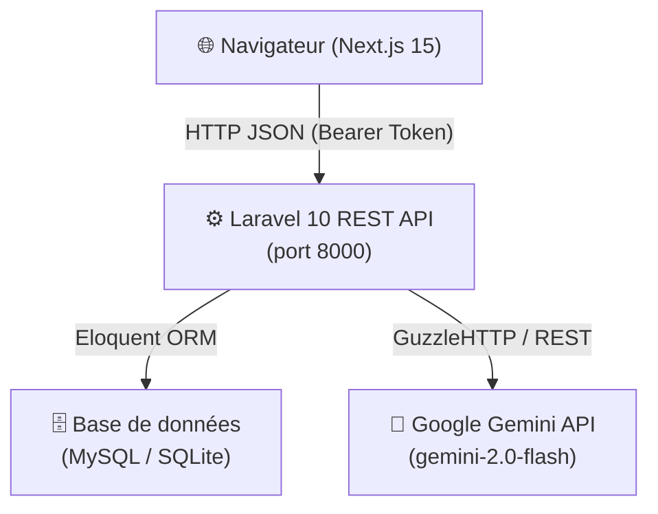
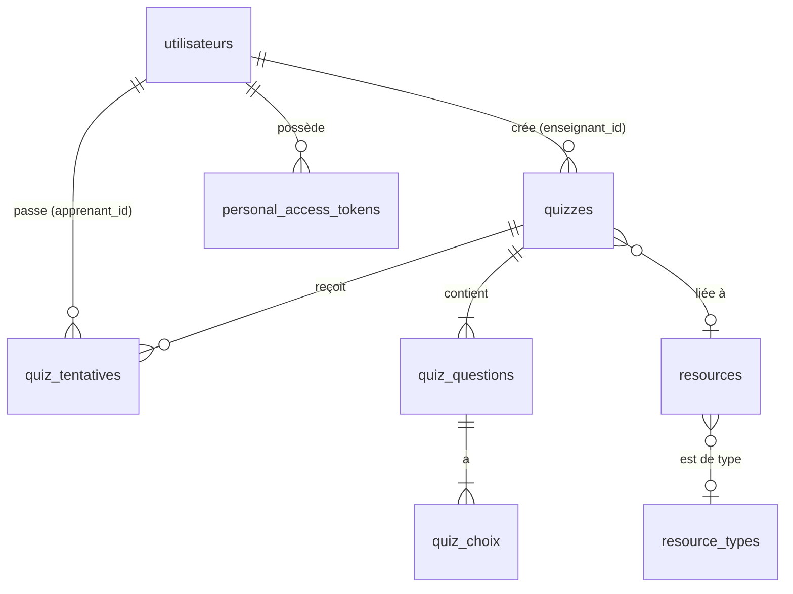

# 📊 Rapport d'Analyse — Projet **EduShare** (ProjetFE)

> Généré le : 28 mars 2026  
> Analysé par : Antigravity AI

---

## 1. Vue d'Ensemble

**EduShare** est une plateforme éducative full-stack permettant :
- La gestion des utilisateurs (Super-Admin, Enseignants, Étudiants)
- Le partage de ressources pédagogiques
- La génération automatique de quiz via l'IA (Google Gemini)
- Le passage de quiz en ligne avec notation automatique

| Composant | Technologie | Version |
|---|---|---|
| Backend API | Laravel | 10.x |
| Frontend | Next.js | 15.x |
| Langage Frontend | TypeScript | 5.x |
| Authentification | Laravel Sanctum | 3.3 |
| IA | Google Gemini API | gemini-2.0-flash |
| HTTP client | GuzzleHTTP | 7.10 |
| UI Framework | MUI + Radix UI + TailwindCSS 4 | — |

---

## 2. Architecture Générale



L'architecture est un **monorepo** avec deux dossiers séparés :
- `backend/` → API Laravel 10
- `Frontend/` → SPA Next.js 15 (App Router)

La communication est entièrement via **REST JSON** avec authentification **Bearer Token** (Sanctum).

---

## 3. Backend — Laravel 10

### 3.1 Structure des Dossiers

```
backend/
├── app/
│   ├── Http/
│   │   ├── Controllers/
│   │   │   ├── AuthController.php
│   │   │   ├── AdminController.php
│   │   │   ├── DisciplineController.php
│   │   │   ├── NiveauController.php
│   │   │   ├── TypeRessourceController.php
│   │   │   └── Api/
│   │   │       └── QuizIaController.php   ← Contrôleur principal quiz
│   │   └── Middleware/  (×9 middlewares)
│   ├── Models/          (×10 modèles Eloquent)
│   └── Services/
│       ├── QuizGeneratorService.php       ← Intégration Gemini
│       └── DocumentTextExtractor.php     ← Extraction texte PDF/DOCX
├── database/
│   └── migrations/      (×23 migrations)
└── routes/
    └── api.php          (×17 endpoints)
```

### 3.2 Modèles Eloquent

| Modèle | Table | Description |
|---|---|---|
| `Utilisateur` | `utilisateurs` | Utilisateur (custom auth, non `users`) |
| `Quiz` | `quizzes` | Quiz avec statuts brouillon/publié/archivé |
| `QuizQuestion` | `quiz_questions` | Questions QCM |
| `QuizChoix` | `quiz_choix` | Choix de réponses |
| `QuizTentative` | `quiz_tentatives` | Tentatives d'apprenants |
| `Formation` | `formations` | Formations pédagogiques |
| `Resource` | `resources` | Ressources pédagogiques |
| `Discipline` | `disciplines` | Disciplines/matières |
| `Niveau` | `levels` | Niveaux scolaires |
| `TypeRessource` | `resource_types` | Types de ressources |

### 3.3 Endpoints API

| Méthode | Route | Rôle | Auth |
|---|---|---|---|
| `POST` | `/api/register` | Inscription | Non |
| `POST` | `/api/login` | Connexion | Non |
| `GET` | `/api/me` | Profil connecté | Oui |
| `POST` | `/api/logout` | Déconnexion | Oui |
| `POST` | `/api/complete-profile` | Compléter profil | Oui |
| `POST` | `/api/update-profile` | MAJ profil | Oui |
| `POST` | `/api/change-password` | Changer mdp | Oui |
| `GET` | `/api/admin/users` | Liste users | Oui |
| `POST` | `/api/admin/create-user` | Créer user | Oui |
| `POST` | `/api/admin/approve-user/{id}` | Approuver | Oui |
| `apiResource` | `/api/admin/types-ressources` | CRUD Types | Oui |
| `apiResource` | `/api/admin/disciplines` | CRUD Disciplines | Oui |
| `apiResource` | `/api/admin/niveaux` | CRUD Niveaux | Oui |
| `POST` | `/api/quiz/generer` | Génération IA | Oui |
| `GET` | `/api/quiz` | Mes quiz | Oui |
| `GET` | `/api/quiz/publies` | Quiz publiés | Oui |
| `GET` | `/api/quiz/public/{slug}` | Détail public | Oui |
| `POST` | `/api/quiz/public/{slug}/soumettre` | Soumettre quiz | Oui |
| `GET` | `/api/quiz/{id}` | Détail quiz | Oui |
| `PUT` | `/api/quiz/{id}/publier` | Publier quiz | Oui |
| `PUT` | `/api/quiz/{id}/archiver` | Archiver quiz | Oui |
| `DELETE` | `/api/quiz/{id}` | Supprimer quiz | Oui |
| `GET` | `/api/quiz/{id}/statistiques` | Stats quiz | Oui |

### 3.4 Service : QuizGeneratorService

Le service d'IA est bien conçu avec les caractéristiques suivantes :
- Intégration directe à **Gemini API** via GuzzleHTTP
- Modèle : `gemini-2.0-flash` (configurable)
- Troncature du texte à **15 000 caractères** max
- **Retry exponentiel** sur erreur 429 : `10s → 20s → 30s → 40s` (max 5 tentatives)
- Parsing robuste JSON avec nettoyage des blocs `\`\`\`json`
- Prompt structuré imposant le format JSON strict

### 3.5 Service : DocumentTextExtractor

- Extraction PDF via **pdftotext** (si Poppler installé) avec **fallback** basique
- Extraction DOCX via **ZipArchive** PHP (lecture du `word/document.xml`)
- Validation : minimum 100 caractères extraits requis avant envoi à l'IA

---

## 4. Frontend — Next.js 15

### 4.1 Structure des Pages (App Router)

```
Frontend/app/
├── page.tsx               ← Landing Page publique
├── login/                 ← Connexion
├── signup/                ← Inscription
├── teacher/               ← Espace Enseignant
│   ├── page.tsx           ← Dashboard enseignant
│   ├── quiz/              ← Gestion des quiz
│   ├── categories/        ← Catégories
│   ├── resources/         ← Ressources pédagogiques
│   ├── students/          ← Gestion des étudiants
│   ├── profile/           ← Profil
│   └── change-password/   ← Changement de mot de passe
├── student/               ← Espace Étudiant
│   ├── page.tsx           ← Dashboard étudiant
│   ├── quiz/              ← Passer les quiz
│   ├── resources/         ← Ressources disponibles
│   ├── categories/        ← Catégories
│   ├── profile/           ← Profil
│   └── change-password/
├── super-admin/           ← Administration complète
│   ├── page.tsx           ← Dashboard admin
│   ├── user-management/   ← CRUD utilisateurs
│   ├── categories/
│   ├── disciplines/
│   ├── levels/
│   └── resource-types/
├── quiz/                  ← Pages quiz publiques
├── formations/            ← Formations
├── resources/             ← Ressources publiques
├── public-resources/      ← Ressources sans auth
├── about/ & contact/      ← Pages vitrine
└── components/            ← Composants partagés
    ├── AuthProviderWrapper.tsx
    ├── Layout.tsx
    ├── PublicLayout.tsx
    ├── ProtectedRoute.tsx
    ├── ProfileSettings.tsx
    ├── ChangePassword.tsx
    └── ui/                ← Composants UI (Radix-based)
```

### 4.2 Gestion de l'Authentification

Le contexte `AuthContext.tsx` implémente :
- Stockage token dans **localStorage** avec horodatage
- **Expiration automatique** après **60 minutes** d'inactivité
  - Timer `setTimeout` + nettoyage au démontage
- Redirection par rôle : `super-admin` → `/super-admin`, `teacher` → `/teacher`, `student` → `/student`
- Composant `ProtectedRoute.tsx` protège les routes privées
- API URL codée en dur : `http://localhost:8000/api` ⚠️

### 4.3 Dépendances Notables

| Catégorie | Packages |
|---|---|
| UI Components | MUI v7, Radix UI (×20 composants), Lucide React |
| Animation | Motion (Framer Motion) v12, tw-animate-css |
| Formulaires | react-hook-form v7 |
| Graphiques | Recharts v2 |
| Drag & Drop | react-dnd v16 |
| Notifications | Sonner v2 |
| Styling | TailwindCSS v4, class-variance-authority |

---

## 5. Base de Données

### 5.1 Schéma Migrations (23 migrations)



### 5.2 Table `quizzes` (Champs principaux)

| Champ | Type | Description |
|---|---|---|
| `titre` | string(255) | Titre du quiz |
| `slug` | string (unique) | URL-friendly |
| `status` | enum | `brouillon`, `publie`, `archive` |
| `temps_limite` | integer (nullable) | Durée en minutes |
| `score_passage` | integer | Seuil de réussite (%) |
| `melange_questions` | boolean | Ordre aléatoire |
| `melange_reponses` | boolean | Choix aléatoires |
| `afficher_correction` | boolean | Afficher correction |
| `nb_tentatives_max` | integer | Limite de tentatives |
| `publie_le` | datetime | Date de publication |
| `expire_le` | datetime (nullable) | Date d'expiration |

### 5.3 Évolution de la BDD (Timeline)

```
Fév 2026 : Table utilisateurs, rôles, statuts, profils
Mar 2026 : Formations, ressources, disciplines, niveaux, types
Mar 2026 : Tables quiz complètes (quiz, questions, choix, tentatives)
```

---

## 6. Sécurité

### 6.1 Points Forts ✅

| Aspect | Implémentation |
|---|---|
| Auth API | Laravel Sanctum (Bearer tokens) |
| Mot de passe | Hashé via `mot_de_passe` cast → `hashed` |
| Protection routes | Middleware `auth:sanctum` sur toutes les routes privées |
| Ownership Quiz | Vérification `enseignant_id` sur chaque action (show, update, delete) |
| Non-exposition des réponses | `showPublic` ne retourne pas `est_correct` |
| Tentatives max | Limitation configurable par quiz |
| Validation entrées | Validation Eloquent sur tous les contrôleurs |
| Upload fichiers | Restriction MIME (`pdf,doc,docx`), taille max 10 Mo |
| Tokens uniques | `$user->tokens()->delete()` à chaque login |

### 6.2 Points d'Amélioration ⚠️

| Problème | Criticité | Recommandation |
|---|---|---|
| URL API codée en dur dans `AuthContext.tsx` | Moyenne | Utiliser une variable d'environnement `.env.local` (`NEXT_PUBLIC_API_URL`) |
| Clé Gemini dans `.env` non-rotée | Haute | S'assurer que le `.env` n'est pas commité (vérifier `.gitignore`) |
| Aucun rate-limiting côté API Laravel | Moyenne | Ajouter `throttle:60,1` sur les routes sensibles (login, generer) |
| Pas de vérification du rôle dans le contrôleur quiz | Moyenne | Vérifier que seuls les `teacher` peuvent accéder à `generer`, `index` |
| Session stockée en `localStorage` | Basse | Risque XSS — envisager `httpOnly cookies` pour plus de sécurité |
| `verify => false` dans GuzzleHTTP | Basse | Désactiver la vérification SSL uniquement en dev, pas en prod |
| `shell_exec('which ...')` sur Windows | Haute | La commande `which` n'existe pas sur Windows — `pdftotext` ne fonctionnera pas |

---

## 7. Fonctionnalité IA — Analyse Détaillée

### 7.1 Flux de Génération

```
1. Upload document (PDF/DOCX, max 10 Mo)
      ↓
2. Extraction texte (pdftotext ou ZipArchive)
      ↓
3. Troncature à 15 000 caractères
      ↓
4. Envoi à Gemini API (prompt structuré)
   └─ Retry exponentiel si 429 (×5 max)
      ↓
5. Parsing JSON de la réponse
      ↓
6. Transaction DB : création Quiz + Questions + Choix
      ↓
7. Retour quiz en statut "brouillon"
```

### 7.2 Qualité du Prompt

Le prompt impose un format JSON strict avec :
- `enonce`, `difficulte` (`facile`/`moyen`/`difficile`), `points` (1/2/3)
- `explication` (justification pédagogique)
- `choix[]` avec `texte` et `est_correct`
- Règles pédagogiques explicites (1-2 bonnes réponses, pas toutes/aucune correctes)

> [!TIP]
> La qualité du prompt est excellente et suit les bonnes pratiques de prompt engineering pour la génération de QCM pédagogiques.

### 7.3 Limites Identifiées

- **Timeout serveur** : `set_time_limit(300)` configuré, mais peut causer des soucis avec certains hébergeurs
- **Synchrone** : La génération est bloquante — envisager une **file d'attente** (`Laravel Queues`) pour les gros documents
- **Pas de cache** : Les mêmes documents re-génèrent un nouveau quiz à chaque fois
- **15 000 caractères max** : Limite suffisante pour des chapitres courts, peut-être insuffisante pour des documents complets

---

## 8. Frontend — Points Forts et Faiblesses

### 8.1 Points Forts ✅

- Architecture **App Router Next.js 15** moderne et propre
- Séparation claire des espaces : teacher / student / super-admin
- Contexte d'authentification bien conçu avec auto-expiration
- Composant `ProtectedRoute` réutilisable
- Stack UI riche (MUI + Radix UI + Recharts pour les graphiques)

### 8.2 Points d'Amélioration ⚠️

| Problème | Recommendation |
|---|---|
| `page.tsx` root très volumineuse (24 Ko) | Refactoriser en sous-composants |
| `ProfileSettings.tsx` très large (25 Ko) | Diviser en sections (PersonalInfo, Documents, etc.) |
| Pas de gestion d'état global (Redux/Zustand) | Pour de grandes apps, envisager Zustand |
| Pas de tests automatisés visibles | Ajouter tests unitaires (Jest) et e2e (Playwright) |
| Pas de `loading.tsx` / `error.tsx` App Router | Ajouter des pages de chargement/erreur Next.js |
| `TypeScript` strict non configuré | Activer `"strict": true` pleinement dans tsconfig |

---

## 9. Qualité du Code

### 9.1 Backend PHP/Laravel

| Critère | Évaluation |
|---|---|
| PSR-4 autoloading | ✅ Respecté |
| Séparation des responsabilités | ✅ Services bien séparés |
| Validation des entrées | ✅ Validation Eloquent complète |
| Gestion des erreurs | ✅ Try/catch + Log::error |
| Transactions DB | ✅ Utilisées pour la création de quiz |
| Commentaires/PHPDoc | ✅ Bien documentés |
| Tests unitaires | ❌ Aucun test visible |
| Configuration externalisée | ✅ Via `config('services.gemini.*')` |

### 9.2 Frontend TypeScript/React

| Critère | Évaluation |
|---|---|
| Typage TypeScript | ⚠️ Partiel (interfaces définies mais non systématiques) |
| Composants réutilisables | ✅ Layout, ProtectedRoute, etc. |
| Gestion des erreurs API | ⚠️ Basique (message générique réseau) |
| `useCallback` / mémoisation | ✅ Utilisé dans AuthContext |
| Configuration environnement | ❌ URL API codée en dur |
| Tests | ❌ Aucun test visible |

---

## 10. Recommandations Prioritaires

### 🔴 Critique (à traiter d'urgence)

1. **Corriger l'extraction PDF sur Windows** : `which` et `pdftotext` ne fonctionnent pas sur Windows. Utiliser une librairie PHP pure comme `smalot/pdfparser` au lieu de `shell_exec`.

2. **Externaliser l'URL de l'API** dans une variable d'environnement Next.js :
   ```env
   # .env.local
   NEXT_PUBLIC_API_URL=http://localhost:8000/api
   ```

### 🟠 Important (à planifier)

3. **Ajouter le rate-limiting Laravel** sur les routes sensibles :
   ```php
   Route::post('/login', ...)->middleware('throttle:10,1');
   Route::post('/quiz/generer', ...)->middleware('throttle:5,1');
   ```

4. **Vérification du rôle** dans `QuizIaController` pour s'assurer que seuls les teachers peuvent générer des quiz.

5. **File d'attente pour la génération IA** : Utiliser Laravel Queues pour rendre la génération asynchrone et éviter les timeouts HTTP.

### 🟡 Améliorations (à long terme)

6. Ajouter des **tests automatisés** (PHPUnit côté Laravel, Jest/Playwright côté Next.js)

7. **Refactoriser les composants volumineux** (`page.tsx` 24Ko, `ProfileSettings.tsx` 25Ko)

8. Implémenter une **stratégie de cache** pour les quiz générés depuis les mêmes documents

9. Ajouter `loading.tsx` et `error.tsx` dans les segments App Router pour une meilleure UX

10. Activer **TypeScript strict mode** : `"strict": true, "noImplicitAny": true`

---

## 11. Résumé Exécutif

```
┌─────────────────────────────────────────────────────────┐
│                   SCORE GLOBAL DU PROJET                │
├────────────────────────┬─────────────────────┬──────────┤
│ Critère                │ Évaluation          │ Score    │
├────────────────────────┼─────────────────────┼──────────┤
│ Architecture           │ Bien structurée     │ ⭐⭐⭐⭐☆ │
│ Fonctionnalités        │ Complètes           │ ⭐⭐⭐⭐☆ │
│ Sécurité               │ Bonne mais à améliorer│ ⭐⭐⭐☆☆ │
│ Qualité du code        │ Solide              │ ⭐⭐⭐⭐☆ │
│ Tests                  │ Absents             │ ⭐☆☆☆☆ │
│ Documentation          │ Moyenne             │ ⭐⭐⭐☆☆ │
│ Performance            │ Synchrone (à optimiser)│ ⭐⭐⭐☆☆ │
├────────────────────────┼─────────────────────┼──────────┤
│ GLOBAL                 │                     │ ⭐⭐⭐☆☆ │
└────────────────────────┴─────────────────────┴──────────┘
```

**Forces principales** : Architecture propre, intégration IA bien réalisée, gestion des rôles, modèle de données solide.

**Axes d'amélioration prioritaires** : Tests, sécurité renforcée, asynchronisme pour la génération IA, compatibilité multi-plateforme.
